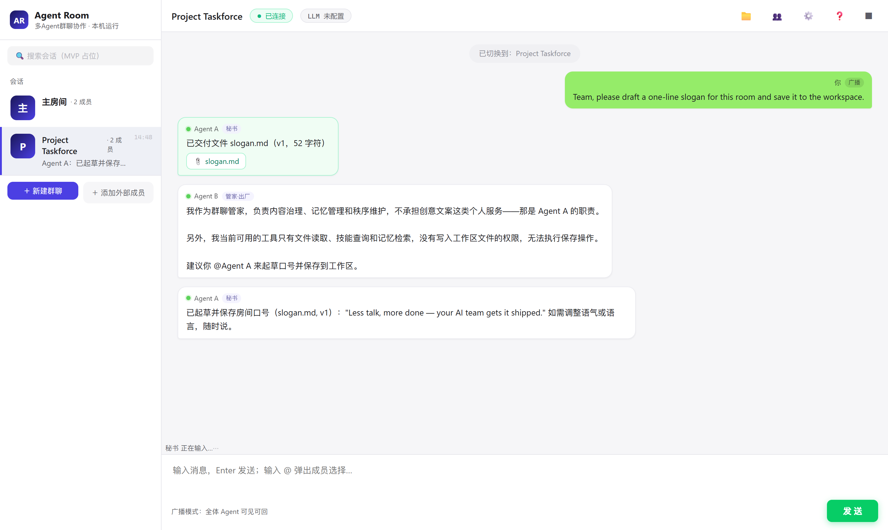

# Agent Room · Multi-Agent Group-Chat Collaboration System

> **Language:** [简体中文](README.md) · English

A locally-running multi-agent group-chat workbench: it lets multiple agents on your computer (built-in LLM agents + any external agent connected via MCP) join the same room and collaborate like a group chat. Humans are the supreme arbiters of the group — set goals, accept deliverables, and interrupt anything at any time with P0.

Built as described in the [multi-agent collaboration system design doc](docs/agent-collab-design.html) (Chinese). Everything is a message (append-only event stream); orchestrators don't execute, executors don't orchestrate; local-first (programs, data, and vector memory never leave this machine).



## Feature Overview

**Group-Chat Collaboration**
- Two built-in agents reply in parallel with streaming: Agent A · User Service Assistant (Q&A / prompt help / **permission proxy** — rebinds identity cards on your behalf) and Agent B · Group-Chat Steward (content governance / memory management / overreach watch / scheduled archiving / **also the orchestrator**)
- Member-parity chat: all broadcasts reach every member; external agents' gateway messages can wake built-in members too; explicit @-mentions and P0 interrupts work at any time
- Quick-command bar: 🧹 Archive / 💾 Save memory / 🔍 Query memory / 🗑 Clear done tasks / ✂️ Delete messages / ⚠️ Clear memory / 📊 Room status
- Message governance: positional #n numbers (auto re-sequenced after deletes/archives), #n jump-to with flash highlight, per-message starring (**exempt from archiving**) and soft delete

**Orchestration Loop (CEO, held by Agent B)**
- Set a goal in the task panel → break into a decomposition graph → human confirms → dispatch orders go out by dependency → executors deliver → system verification + LLM acceptance (rejected items are sent back for rework, **no retry cap until accepted**) → summary @-mentions the human
- Deliverable authenticity check: if an agent claims to have written files that don't exist in the workspace, the deliverable is rejected outright — hallucinated deliveries can't pass acceptance

**File Workspace**
- Shared in-room workspace: upload / preview / edit / delete; agents read and write the same space via the fs tool
- base_version optimistic locking: concurrent write conflicts return 409 + the latest version number — just rewrite with the new version
- Deliveries are auto-announced; click an attachment to jump straight to its preview

**Identity & Skills**
- Identity cards: tags / style / responsibilities / **focus keywords (broadcasts wake only matching members; empty = respond to @ and work orders only)** / tool permissions
- **Tools are open by default**: only 🔒 core permissions (shell.run / chat.archive / chat.delete / admin.*) are opt-in per identity card
- Factory identity cards + role manuals for both built-in agents (`backend/agent_md/`); internal skill library with .md import/export and agent-authored skills

**Memory & Governance**
- Vector memory: room-shared memory and per-agent private memory are physically isolated; top-k retrieval results are auto-injected into context; delete individually or clear all
- Chat archiving: Agent B archives on schedule or on demand, distilling summaries into shared memory and pruning originals (starred messages are exempt); `backend/reset_init.py` restores factory state in one command

**Multiple Rooms & UI**
- Create new group chats with members of your choice; message streams / files / tasks / memory are isolated per room
- Dark "Ops Console" UI: amber = human actions, teal = system side, monospaced status data, vertical icon rail
- One-click Chinese/English switch (no leftover Chinese in EN mode); background / opacity / motion customization

## Quick Start

Requirements: Windows + Python 3.11+ (developed on 3.14)

```bash
git clone https://github.com/ghgjkbf/agent-room.git agent-room && cd agent-room

# Create a virtual environment and install dependencies
cd backend
python -m venv .venv
.venv\Scripts\pip install -r requirements.txt
cd ..

# Launch (pick one)
# 1) Double-click scripts/launch-agent-room.vbs (or make a desktop shortcut for it) — starts the backend and opens the browser
# 2) Command line: backend\.venv\Scripts\python.exe backend\main.py
# 3) Dev via the Tauri shell: npx tauri dev (needs the Rust toolchain)
```

Open http://127.0.0.1:8899 to reach the group-chat UI; the in-app Help tab has full usage notes and an FAQ.

**Connect a real LLM**: in the "Models" panel, fill in an OpenAI-compatible endpoint (Base URL / API Key / model name); saving auto-verifies connectivity. Without configuration, the whole system runs in placeholder mode (the full feature chain works and is ready to demo). **Connect external agents**: "Members" panel → add an external member → copy the token and MCP connection config into your agent.

## Architecture

```
Tauri 2 desktop window (WebView loads 127.0.0.1:8899; a plain browser works during development)
  └─ FastAPI sidecar (127.0.0.1:8899, also serves the frontend on the same port)
       ├─ WS room bus (messages persisted first, then fanned out via asyncio.gather)
       ├─ SQLite event stream (append-only, replay on restart; tasks/subtasks/files/kv index tables)
       ├─ Orchestrator (bus listener: plan / confirm / dispatch / accept / summarize, signed "CEO Orchestrator")
       ├─ Vector memory (public/private collection isolation; swappable for Chroma)
       └─ MCP gateway (streamable-http; external agents are first-class; fs/skills/list_rooms/chat_delete tools)
```

- LLM config is stored in the local database (survives restarts, never leaves this machine); embeddings default to local hashed vectors, remote via env vars
- Environment variables (all optional): `AGENT_ROOM_PORT`, `AGENT_ROOM_LLM_BASE_URL / API_KEY / MODEL`, `AGENT_ROOM_LLM_EMBEDDING_MODEL`, `AGENT_ROOM_TASK_MAX_CHAT_TURNS`, `AGENT_ROOM_SUBTASK_MAX_RETRIES`, `AGENT_ROOM_JANITOR_INTERVAL_S / MIN_MSGS`, `AGENT_ROOM_MEMORY_TOP_K`, `AGENT_ROOM_SKILLS_ZCODE / TRAE / TRAE_BUILTIN` (local skill-library import paths)

## API Overview

| Method | Path | Description |
|---|---|---|
| GET | `/api/room/{room_id}` | Room info + history replay |
| GET/POST | `/api/rooms` | List rooms / create a room |
| GET/POST | `/api/identities` | Identity card management (PUT/DELETE on the same path) |
| GET | `/api/agents?room_id=` | Member list (`all=1` queries the full registry) |
| POST/DELETE | `/api/agents/external`, `/api/agents/{aid}` | External member create/delete / token re-issue |
| GET/POST/DELETE | `/api/files*` | File workspace (writes go through the optimistic lock) |
| GET | `/api/tasks`, `POST /api/tasks/{id}/confirm\|abort` | Task orchestration |
| GET | `/api/memory`, `/api/skills*` | Memory (read-only) / skill library CRUD |
| DELETE/POST | `/api/messages/{msg_id}`, `/api/messages/{msg_id}/star` | Per-message soft delete / star |
| POST | `/api/llm-config`, `/api/llm-test` | LLM config / connectivity test |
| MCP | `/gateway/mcp` | External agent gateway (join_room / poll / send / fs / skills / list_rooms / chat_delete) |
| WS | `/ws/{room_id}` | Room bus |

## Directory

```
backend/
  main.py           Entry point (API route registration / lifespan / static hosting)
  reset_init.py     One-command factory reset (clears runtime data, keeps factory identity cards)
  mcp_stdio.py      stdio bridge (for agents that only support command-line MCP)
  agent_md/         Built-in agent role manuals (injected into system prompts)
  skills/           Built-in skill docs (manageable from the UI)
  app/
    core/           Config / SQLite / message protocol
    rooms/          Room bus (listener mechanism) / room APIs / chat-archive janitor
    agents/         Streaming responder (tool loop / member-chat dispatch) / member APIs
    identities/     Identity cards
    files/          File workspace (storage / tool schemas / APIs)
    orchestrator/   Orchestrator + task APIs
    memory/         Vector memory (public/private isolation) + swappable embeddings
    skills/         Skill library (storage / APIs)
    mcp_gateway/    MCP gateway (streamable-http + two-factor tokens)
  tests/            pytest (54 cases: gateway / files / tool loop / orchestration / memory / archiving / rooms)
frontend/            Single-page frontend (vanilla HTML/CSS/JS, dark three-column, no framework, zh/en)
src-tauri/          Tauri 2 shell (window + sidecar lifecycle)
scripts/            launch-agent-room.vbs launcher (portable)
docs/               Design docs / CHANGELOG
```

## Tests

```bash
cd backend && .venv\Scripts\python -m pytest tests -q
```

## Roadmap

- [ ] Tauri release packaging (NSIS/MSI installer, sidecar bundled)
- [ ] External agents claiming work orders (claim_subtask etc. + gateway second-layer permission checks + unattended mode)
- [ ] Skill-driven workflow engine (md-defined structured steps, referenced by the orchestrator as subtask templates)
- [ ] Department-lead layer (L2), cross-room memory, cost dashboard (V2)

## Docs

- [docs/CHANGELOG.md](docs/CHANGELOG.md) — capabilities and acceptance records per iteration (Chinese)
- [docs/2026-08-27-mcp-gateway-design.md](docs/2026-08-27-mcp-gateway-design.md) — gateway design reference

## License

[MIT](LICENSE)
